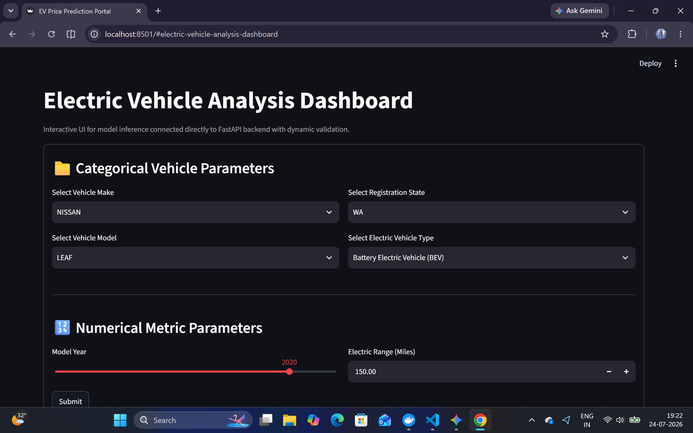

# ⚡ Electric Vehicle (EV) Price Prediction Portal

An end-to-end Machine Learning web application and API microservice built to predict Base MSRP prices for Electric Vehicles based on technical specs and registration parameters.



---

## 📌 Project Overview

This project implements a complete **MLOps pipeline** containerized with Docker. It processes the raw Washington State EV Population dataset, filters out incomplete/zero-price records, trains an `scikit-learn` Random Forest Regressor pipeline, and serves inference via a FastAPI backend connected to an interactive Streamlit UI.

### Key Features
* **Dynamic Pipeline Training:** Trains directly inside the Docker build step to avoid Drive/environment sync issues.

* **Automated Categorical Extraction:** Generates dynamic dropdown choices for the frontend directly from the trained model artifacts.

* **Microservice Architecture:** Fully containerized backend (FastAPI) and frontend (Streamlit) services using Docker Compose.

* **Robust Preprocessing:** Handles missing/zero MSRP entries, standardizes numerical features (`Model Year`, `Electric Range`), and encodes categorical variables (`Make`, `Model`, `State`, `Electric Vehicle Type`).

---

## 🏗️ System Architecture & Hierarchy

```text
📁 Project Root
├── 📂 assets/
│   └── 🖼️ app_preview.png             
├── 📂 data/
│   └── 📄 Electric_Vehicle_Population_Data.csv
│
├── ⚙️ train.py                       
│   └── Outputs ➔ 📦 model_artifact.pkl
│
├── ⚙️ gen.py                         
│   └── Outputs ➔ 📄 categorical_options.json
│
├── 🚀 app.py                         
│
├── 🎨 frontend.py                    
│
└── 🐳 Docker Infrastructure          
    ├── Dockerfile.backend
    ├── Dockerfile.frontend
    └── docker-compose.yml

🛠️ Tech Stack
Machine Learning: Python 3.11, scikit-learn, pandas, numpy

Backend API: FastAPI, Uvicorn, Pydantic

Frontend UI: Streamlit, Requests

Containerization: Docker, Docker Compose

🚀 Getting Started
Prerequisites
Make sure you have Docker Desktop installed and running on your machine.

Local Deployment via Docker Compose
Clone the repository:

git clone <your-repository-url>
cd Summer_Training_project
Build and launch the containers:

docker compose up --build
Access the Application:

Streamlit Frontend UI: http://localhost:8501

FastAPI Backend Swagger Docs: http://localhost:8000/docs

🔌 API Endpoints
POST /predict
Accepts a JSON feature vector and returns the estimated Base MSRP.

Sample Request Body:
{
  "Make": "TESLA",
  "Model": "MODEL 3",
  "State": "WA",
  "Electric_Vehicle_Type": "Battery Electric Vehicle (BEV)",
  "Model_Year": 2022,
  "Electric_Range": 220.0
}

Sample Response:
{
  "prediction": {
    "predicted_price": 46990.0,
    "primary_class_label": "Class_Positive",
    "confidence_score_pct": 46990.0,
    "alternate_score_pct": 0.0
  }
}
Returns available unique categories for dynamic UI dropdowns.

🧹 Stopping the Application
To shut down and clean up running containers:

docker compose down